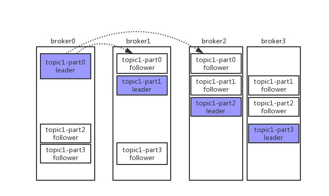

# kafka

### kafka架构

    

### 副本放置策略　　
> * Kafka分配Replica的算法如下(注意!!! 下面的broker、partition副本数这些编号都是从0开始编号的)：
> 将所有存活的N个Brokers和待分配的Partition排序
> * 将第i个Partition分配到第(i mod n)个Broker上，这个Partition的第一个Replica存在于这个分配的Broker上，
  并且会作为partition的优先副本( 这里就基本说明了一个topic的partition在集群上的大致分布情况 )
> * 将第i个Partition的第j个Replica分配到第((i + j) mod n)个Broker上
> * 假设集群一共有4个brokers，一个topic有4个partition，每个Partition有3个副本。
  下图是每个Broker上的副本分配情况 
  
